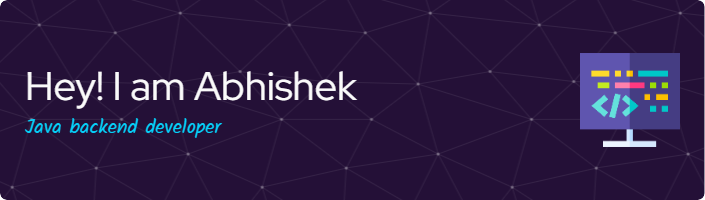

- 👋 Hi, I’m @Abhishek kumar
- 👀 I’m interested in Games
- 🌱 I’m currently learning Web developmet

<!---
Abhishek-RX/Abhishek-RX is a ✨ special ✨ repository because its `README.md` (this file) appears on your GitHub profile.
You can click the Preview link to take a look at your changes.
--->

### Hi there 👋

I am Abhishek kumar, I am a Java back-end developer and love writing clean and maintainable code. Find out more about me & feel free to connect with me here:

## ⚡ Technologies

